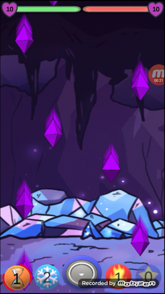

#  Crystal-Battles-Android-Game  
#  Information 
This is a 2D 1-vs-1 multiplayer game that supports LAN and Online game sessions between 2 Players. Made with Unity3D.  
# Things Learned 
* Networking (for LAN games) using Unity's low-level TransportLayer API  
* FireBase Realtime Database (for online game sessions)
* Animations 
#  Screenshots  

#  Try it  
Download and install the "Crystals.apk" file from the files in this repo.

